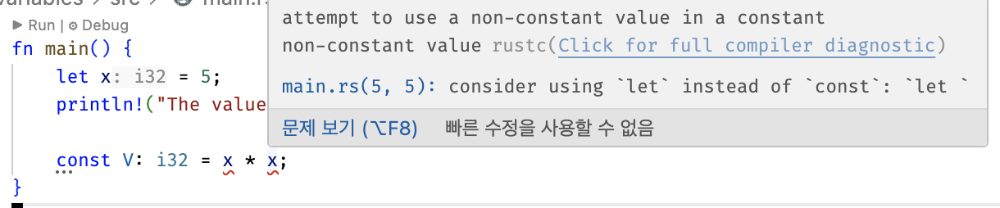

# Ch03: Basic

한줄평: 불변최고 / 패턴매칭 최고 / 전형적인 정적타입 언어 체계에 함수형 피처를 실용적으로 녹였다. 굉장히 맛있음

## 1. 선언

### let
- 기본적으로 불변

- 뮤터블은 mut 키워드 추가

### const
- 타입 필수 명시

- 선언 스코프 제한 X

- 런타임 계산값 할당 불가 -> *런타임 시점의 불안정성이 전파되지 않음이 보장되는 장치인가?? 진짜 "상수"로 쓰는 용도같음*


### shadowing
- 같은 스코프여도 이미 선언된 변수를 재선언할 수 있음. 타입 변경도 됨;

  -> *남용하면 스파게티 생산기일듯. **안티패턴 사례, 권장 가이드라인 확인 필요***

  -> 작은 스코프 단위에서의 타입 전환이나, 큰 스코프에서 좁은 스코프로 줄여가는 방향에서는 사용에 큰 이슈 없을듯

## 2. 타입

### 스칼라 타입
- 정수, 실수, bool, string 타입들 -> c++이랑 비슷

#### 정수형
- `i8 ... i128` / `u8 ... u128`
- `isize` / `usize`: 아키텍처 bit에 맞춤
- 특정 타입 리터럴: `57u8`처럼 쓸 수 있음

|기수 |	리터럴|
|-|-|
Decimal|	`98_222`
Hex	|`0xff`
Octal	|`0o77`
Binary	|`0b1111_0000`
Byte (u8 only)	|`b'A'`

#### 부동 소수점
- `f32`, `f64`. 기본은 64비트

#### bool
- 1바이트

#### Character
- `char`가 4바이트다 충격. 유니코드 표현이 가능

### Compound type
#### 튜플
```rs
fn main() {
    let tup: (i32, f64, u8) = (500, 6.4, 1);

    // destructuring
    let (x, y, z) = tup;

    // dot indexing
    let five_hundred = x.0;
    let six_point_four = x.1;
    let one = x.2;
}
```

#### 배열
- 러스트는 c랑 다르게 인덱스 넘어서 접근하면 런타임에서 터진다고 한다. 캬 이게 언어지
```rs
fn main() {
    // [type, length]
    let a: [i32; 5] = [1, 2, 3, 4, 5];

    // [init, length]
    let a = [3; 5];
}
```

## 3. 함수
- 선언 위치에 상관 없이 호출 가능
### 구문과 표현식
- statement는 값을 반환하지 않는다
```rs
fn main() {
    let x = (let y = 6); // 불가
}
```

- expression은 세미콜론을 붙이지 않는다;;

  -> 아래 코드에서 `x+1`에 세미콜론을 붙이면 문으로 간주되고, 값을 반환하지 않는다.
```rs
{
    let x = 3;
    x + 1
}
```

### 리턴
- 화살표(`->`)로 반환타입 지정

- `return` 사용 가능하지만, 사용하지 않아도 암묵적으로 마지막 expression을 반환한다.
```rs
fn five() -> i32 {
    5
}
fn main() {
    let x = five();

    println!("The value of x is: {x}"); // "x is: 5"
}
```

## 4. Control Flow
### `if` expression
- 러스트에서 `if`는 표현식이다🚀

- 조건식은 괄호로 감싸지 않는다

- 조건식은 항상 boolean이어야 함

- 제어절이 식이라서 이런 코드가 가능하다. 아주 맘에 든다
```rs
fn main() {
    let condition = true;
    let number = if condition { 5 } else { 6 };

    println!("The value of number is: {number}");
}
```
- 단, 변수는 한 타입만 가질 수 있음을 주의해야 함. 이런 케이스에서 `if` / `else if` / `else`는 모두 같은 타입을 반환해야한다
```rs 
fn main() {
    let condition = true;

    // ERROR!!
    let number = if condition { 5 } else { "six" };
}
```

### 반복문
- loop도 값 반환이 된다. break 뒤에 값을 넣자
```rs
fn main() {
    let mut counter = 0;

    let result = loop {
        counter += 1;

        if counter == 10 {
            break counter * 2;
        }
    };

    // result == 20
    println!("The result is {result}");
}
```

- 작은 따옴표로 시작하는 `loop label`을 명시할 수 있다. 한정적인 goto 느낌 
```rs
fn main() {
    let mut count = 0;
    'counting_up: loop {
        println!("count = {count}");
        let mut remaining = 10;

        loop {
            println!("remaining = {remaining}");
            if remaining == 9 {
                break;
            }
            if count == 2 {
                break 'counting_up;
            }
            remaining -= 1;
        }

        count += 1;
    }
    println!("End count = {count}");
}
```

- 근본 `while`문도 있다

- 근본 `for`문도 있다. 근데 얘는 컬렉션 순회용이다
```rs
fn main() {
    let a = [10, 20, 30, 40, 50];

    for element in a {
        println!("the value is: {element}");
    }
}
```

- 범위 리터럴이 지원된다. 하프오픈 구간이고, 아래 리터럴 `(1..4)`의 반환 타입은 `std::ops::Range<i32>`
  
  레인지 제네릭 타입은 추론되는거에 따라 알아서 정해진다. 위 케이스에서는 정수가 기본적으로 int로 간주돼서 그렇고, `1u64..4u64` 같은건 `Range<u64>`를 반환
```rs
fn main() {
    for number in (1..4).rev() {
        println!("{number}!");
    }
    println!("LIFTOFF!!!");
}
```

## 책에서 내준 숙제
* 귀찮아서 입력 헬퍼 만들었다: [lib.rs > read_until_parse](./src/lib.rs)

  입력 프롬프트랑 파서 함수를 인자로 받는다.

  알게된 사실: `where`가 ts의 `extends`와 유사하게 제네릭 제한을 좁히는 용도이다

#### 화씨 온도와 섭씨 온도 간 변환하기
* source: [convert_temp.rs](./src/bin/convert_temp.rs)

* 알게된 사실
  * rust는 실수<->정수 연산시에 자동 형변환 대신 컴파일 에러를 발생시킨다 

  * 다른 타입간 비교도 안된다.

  * C++에서 배열 기반 문자열(`char[]`)과 문자열 리터럴(`"..."`)이 다른 것처럼, Rust도 `String`과 `&str`이 다르다.
    - `&str` : 문자열 리터럴처럼 불변, 읽기 전용 뷰 (`const char*` 비슷)
    - `String` : 힙에 소유권을 가진 가변 문자열 (`std::string` 비슷)

    -> 다만 C++의 구분은 포인터/배열 관점이고, Rust의 구분은 소유권과 참조 모델 관점이라서 실제로는 별개의 영역이긴 함. 느낌만 가져가자

  * JS에서 간단한 함수 객체로 모으듯, 컨버터에 대한 네임스페이스를 가두고 싶었다.

    * `mod`는 좀더 네임스페이스에 가깝고, `impl`는 뭐시냐 구조체 구현에 가까운? 클래스는 아닌데 암튼 그럼. trait같은거 공부한뒤에 다시 알아보자

    * 결과적으로 impl로 가볍게 모듈화함


#### n번째 피보나치 수 생성하기
* source: [fibonacci.rs](./src/bin/fibonacci.rs)

* 알게된 사실
  * match는 match guard라 해서, 부합하는 패턴에서 추가 조건 판단을 걸 수 있다.

  * rust 문법 특성으로 아래처럼 여러가지로 짜봤는데, 러스트 생태계에서 어느 방식이 선호되는지는 알아봐야겠다.

    개인적으론 match가 깔끔해서 좋다. ts-pattern 써볼까?
    ```rs
    fn fibo(n: i32) -> i32 {
        if n == 0 {
            return 0;
        } else if n == 1 {
            return 1;
        }

        return fibo(n - 1) + fibo(n - 2);
    }

    fn fibo(n: i32) -> i32 {
        if n == 0 {
            0
        } else if n == 1 {
            1
        } else {
            fibo(n - 1) + fibo(n - 2)
        }
    }

    fn fibo(n: i32) -> i32 {
        match n {
            0 => 0,
            1 => 1,
            _ => fibo(n - 1) + fibo(n - 2),
        }
    }
    ```


#### 크리스마스 캐롤 ‘The Twelve Days of Christmas’ 노래의 반복성을 활용하여 가사 출력해보기
* source: [carol.rs](./src/bin/carol.rs)

* 알게된 사실
  * `1..=12`는 `RangeInclusive`타입으로, 닫힌 구간이다. 개발자에게 직관적인 하프오픈(`Range`)을 `1..12`처럼 디폴트로 두고, 뒤에도 닫힌 구간을 특별케이스로 간주하면서 편의 문법을 제공하는듯.

  * 배열 인덱스는 반드시 `usize`여야 한다고 한다. 그래서 `&LINES[..month.into()]`와 같이 into 함수를 이용해줬는데, 얘는 사용되는 컨텍스트에 따라 컴파일러가 변환 타입을 알아서 추론해준다고 한다 ㄷㄷ 

  * [**Propagating Error**](https://doc.rust-lang.org/book/ch09-02-recoverable-errors-with-result.html#propagating-errors)의 syntactic sugar: [**`?` 연산자**](https://doc.rust-lang.org/book/ch09-02-recoverable-errors-with-result.html#a-shortcut-for-propagating-errors-the--operator)

  * rust의 배열은 스택영역이라 고정이고, vector를 이용하면 평소에 하는거랑 다를게 없어서 함수형 스타일로 짜보고싶었음. GPT의 도움을 좀 받아보았다([fn verse_for_month](./src//bin//carol.rs#L32-L44)). 결과적으로 이터레이터를 이용하는 코드인데. 기본적인 흐름 자체는 이해돼서 지금 자세히 분석하는거보다 이후 러스트의 메모리 관리 개념을 좀더 학습하고 다시와서 살펴보도록 하자.

  * 성능 생각해서 for문 열심히 돌리지 말고, 그냥 함수형 스타일로 밀어도 되는가? 에 대한 답변: 

   > - 결론: 함수형(이터레이터) 스타일로 밀어도 됩니다. 지금 설계(오프닝만 String, 나머지는 &'static str → Cow<'static, str>로 노출)는 일반적인 Rust 빌드(특히 --release)에서 거의 제로-오버헤드로 최적화됩니다.
   > 
   > - 왜 괜찮나
   >     - 모노모픽 + 인라이닝: impl Iterator 반환은 호출 지점에서 구체 타입으로 특수화되어 루프 하나로 펴집니다. 보통 수작업 for-루프와 성능 차이가 없습니다.
   >     - 할당 최소화: 오프닝 한 줄만 String(1회 할당), 나머지는 전부 Borrowed로 흘러 추가 할당 없음.
   >     - I/O가 지배: 실제로는 println! 같은 I/O가 비용 대부분을 차지해 이터레이터 오버헤드는 체감되지 않습니다.
   >
   > - 주의할 점
   >     - Trait object 지연 바운딩: Box<dyn Iterator<...>>로 동적 디스패치를 쓰면 인라이닝이 깨져 미세한 비용이 생길 수 있음. 지금처럼 impl Iterator면 OK.
   >     - 불필요한 소유 전환: 매번 String으로 collect → join을 남발하면 힙 할당 증가. 필요한 시점에만 모으기.
   >     - 디버그 빌드 측정: 디버그 모드는 최적화 전이라 비교가 왜곡됨. 성능 판단은 --release 기준.
   >
   > - 추천 운용
   >     - 데이터 접근 레이어: carol_lines_up_to(month) -> Option<&[&'static str]> 유지 (무할당 뷰).
   >     - 표현 레이어: verse_for_month(month) -> Option<impl Iterator<Item = Cow<'static, str>>>로 함수형 스타일 제공.
   >     - 편의 API(필요 시): 호출부에서 이터레이터를 collect::<Vec<_>>() 또는 join("\n")으로 마무리. 평소엔 이터레이터 직접 소비.
   >
   > - 실무 팁
   >     - 미세 최적화가 필요하면 criterion.rs로 벤치마크 후 판단(생각보다 차이 작음).
   >     - 아주 뜨거운 경로라면 문자열 합치기 대신 fmt::Write/io::Write에 바로 write!/writeln! 사용이 가장 저렴.
   >
   > - 요약: 성능을 크게 해치지 않으면서 가독성과 조립 유연성을 얻고 싶다면, 지금처럼 함수형 이터레이터 접근을 계속 써도 충분히 Rust-스러우면서 실용적임.
